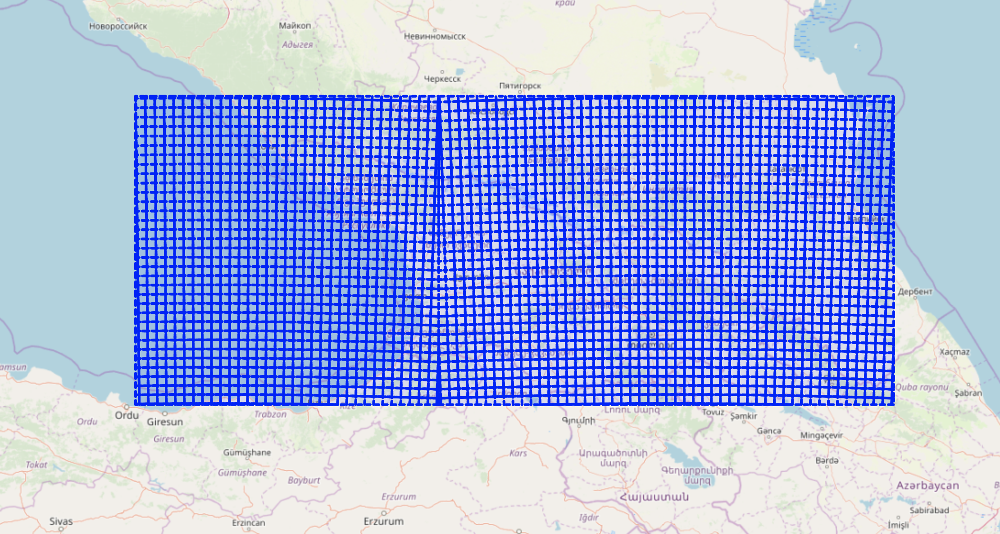

# MGRS to WGS 84 GeoJSON

Node.js script to create GeoJSON file with grid of MGRS zones for EPSG:4326 (WGS 84) coordinate system

It's not finished yet and has some hardcoded values which currently generate MGRS grid for country of Georgia.

Please refer to the source of `mgrs.js` to modify it for your needs.

You can view example MGRS grid on map at <https://mgrs-wgs84.patrykkalinowski.com>

To run example on your machine, download the project and run `yarn run dev`